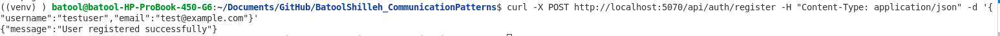
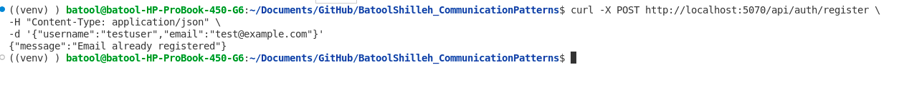
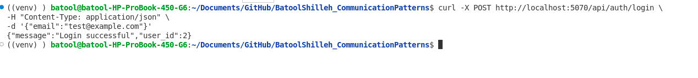
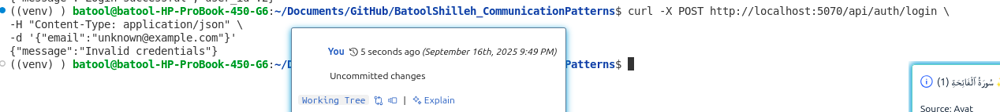
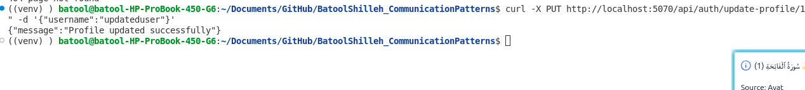
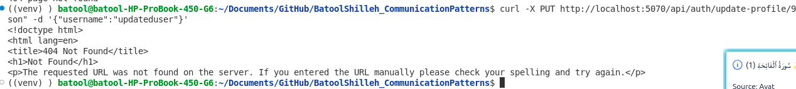

# Testing Guide: FoodFast Platform (Terminal-Based)

## Feature 1: Customer Account Management

**Endpoints Tested:**

* `POST /api/auth/register`
* `POST /api/auth/login`
* `PUT /api/auth/update-profile/<user_id>`

---

### 1. Register a New User

**Test Steps:**

1. Open terminal and run:

```bash
curl -X POST http://localhost:5070/api/auth/register \
-H "Content-Type: application/json" \
-d '{"username":"testuser","email":"test@example.com"}'
```

2. Verify that the terminal output shows:

```json
{"message": "User registered successfully"}
```

**Screenshot Placeholder:**


**Negative Test Case:**

* Attempt to register the same email twice:

```bash
curl -X POST http://localhost:5070/api/auth/register \
-H "Content-Type: application/json" \
-d '{"username":"testuser","email":"test@example.com"}'
```

* **Expected Result:** Terminal shows:

```json
{"message": "Email already registered"}
```

**Screenshot Placeholder:**


---

### 2. Login Existing User

**Test Steps:**

1. Run in terminal:

```bash
curl -X POST http://localhost:5070/api/auth/login \
-H "Content-Type: application/json" \
-d '{"email":"test@example.com"}'
```

2. Verify output:

```json
{
  "message": "Login successful",
  "user_id": <actual_user_id>
}
```

**Screenshot Placeholder:**


**Negative Test Case:**

* Use unregistered email:

```bash
curl -X POST http://localhost:5070/api/auth/login \
-H "Content-Type: application/json" \
-d '{"email":"unknown@example.com"}'
```

* **Expected Result:**

```json
{"message": "Invalid credentials"}
```

**Screenshot Placeholder:**


---

### 3. Update User Profile

**Test Steps:**

1. Run in terminal (replace `<user_id>` with actual ID):

```bash
curl -X PUT http://localhost:5070/api/auth/update-profile/<user_id> \
-H "Content-Type: application/json" \
```

2. Verify output:

```json
{"message": "Profile updated successfully"}
```

**Screenshot Placeholder:**


**Negative Test Case:**

* Use non-existent `user_id`:

```bash
curl -X PUT http://localhost:5070/api/auth/update-profile/9999 \
-H "Content-Type: application/json" \
-d '{"username":"updateduser"}'
```

* **Expected Result:** HTTP 404 Not Found

**Screenshot Placeholder:**

---

