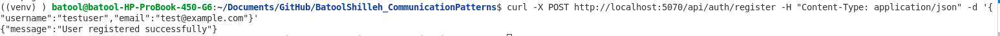
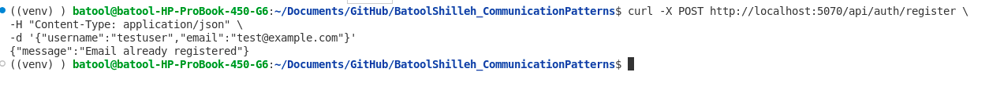
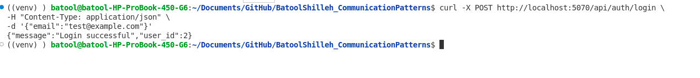
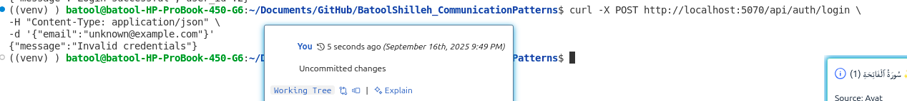
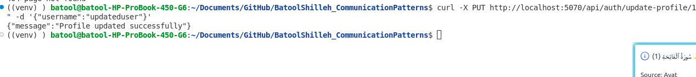
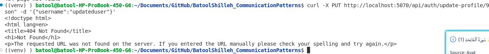
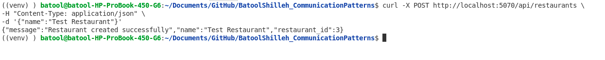
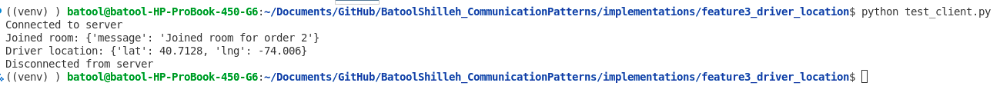
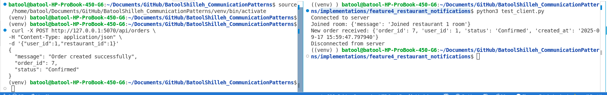

# Testing Guide: FoodFast Platform (Terminal-Based)

## Feature 1: Customer Account Management

**Endpoints Tested:**

* `POST /api/auth/register`
* `POST /api/auth/login`
* `PUT /api/auth/update-profile/<user_id>`

---

### 1. Register a New User

**Test Steps:**

1. Open terminal and run:

```bash
curl -X POST http://localhost:5070/api/auth/register \
-H "Content-Type: application/json" \
-d '{"username":"testuser","email":"test@example.com"}'
```

2. Verify that the terminal output shows:

```json
{"message": "User registered successfully"}
```

**Screenshot Placeholder:**


**Negative Test Case:**

* Attempt to register the same email twice:

```bash
curl -X POST http://localhost:5070/api/auth/register \
-H "Content-Type: application/json" \
-d '{"username":"testuser","email":"test@example.com"}'
```

* **Expected Result:** Terminal shows:

```json
{"message": "Email already registered"}
```

**Screenshot Placeholder:**


---

### 2. Login Existing User

**Test Steps:**

1. Run in terminal:

```bash
curl -X POST http://localhost:5070/api/auth/login \
-H "Content-Type: application/json" \
-d '{"email":"test@example.com"}'
```

2. Verify output:

```json
{
  "message": "Login successful",
  "user_id": <actual_user_id>
}
```

**Screenshot Placeholder:**


**Negative Test Case:**

* Use unregistered email:

```bash
curl -X POST http://localhost:5070/api/auth/login \
-H "Content-Type: application/json" \
-d '{"email":"unknown@example.com"}'
```

* **Expected Result:**

```json
{"message": "Invalid credentials"}
```

**Screenshot Placeholder:**


---

### 3. Update User Profile

**Test Steps:**

1. Run in terminal (replace `<user_id>` with actual ID):

```bash
curl -X PUT http://localhost:5070/api/auth/update-profile/<user_id> \
-H "Content-Type: application/json" \
```

2. Verify output:

```json
{"message": "Profile updated successfully"}
```

**Screenshot Placeholder:**


**Negative Test Case:**

* Use non-existent `user_id`:

```bash
curl -X PUT http://localhost:5070/api/auth/update-profile/9999 \
-H "Content-Type: application/json" \
-d '{"username":"updateduser"}'
```

* **Expected Result:** HTTP 404 Not Found

**Screenshot Placeholder:**

---

## Feature 2: Order Tracking

**Endpoints Tested:**

* `POST /api/restaurants`
* `POST /api/orders`
* `GET /api/orders/<order_id>/status`
* `PUT /api/orders/<order_id>/status`

---

### 1. Create a Restaurant

**Test Steps:**

1. Run in terminal:

```bash
curl -X POST http://localhost:5070/api/restaurants \
-H "Content-Type: application/json" \
-d '{"name":"Test Restaurant"}'
```

2. Expected output:

```json
{
  "message": "Restaurant created successfully",
  "restaurant_id": 1,
  "name": "Test Restaurant"
}
```

**Screenshot Placeholder:**


**Negative Test Case:**

* Missing name field:

```bash
curl -X POST http://localhost:5070/api/restaurants \
-H "Content-Type: application/json" \
-d '{}'
```

* **Expected Result:**

```json
{"error": "Restaurant name is required"}
```
**Screenshot Placeholder:**


---

### 2. Create a New Order

**Test Steps:**

1. Run in terminal (replace `<user_id>` and `<restaurant_id>` with actual IDs):

```bash
curl -X POST http://localhost:5070/api/orders \
-H "Content-Type: application/json" \
-d '{"user_id":1,"restaurant_id":1}'
```

2. Expected output:

```json
{
  "message": "Order created successfully",
  "order_id": 1,
  "status": "Confirmed"
}
```

**Screenshot Placeholder:**


**Negative Test Case:**

* Invalid user or restaurant ID:

```bash
curl -X POST http://localhost:5070/api/orders \
-H "Content-Type: application/json" \
-d '{"user_id":999,"restaurant_id":1}'
```

* **Expected Result:**

```json
{"error": "User or Restaurant not found"}
```
**Screenshot Placeholder:**


---

### 3. Get Order Status (Long Polling)

**Test Steps:**

1. Run in terminal:

```bash
curl -X GET "http://localhost:5070/api/orders/1/status?last_status=Pending"
```

2. Expected output:

```json
{"order_id": 1, "status": "Confirmed"}
```

**Screenshot Placeholder:**


---

### 4. Update Order Status

**Test Steps:**

1. Run in terminal:

```bash
curl -X PUT http://localhost:5070/api/orders/1/status \
-H "Content-Type: application/json" \
-d '{"status":"Delivered"}'
```

2. Expected output:

```json
{"order_id": 1, "status": "Delivered"}
```

**Screenshot Placeholder:**
[Watch the video](./asset/f2/Screencast%20from%202025-09-16%2022-33-54.mp4)


**Negative Test Case:**

* Missing status field:

```bash
curl -X PUT http://localhost:5070/api/orders/1/status \
-H "Content-Type: application/json" \
-d '{}'
```

* **Expected Result:**

```json
{"error": "Missing status"}
```

---


## Feature 3: Real-Time Driver Location (Socket.IO)

**Purpose:**
Send and receive driver GPS coordinates in real time using WebSocket with Socket.IO.

---

### 1. Start the Server

1. Make sure the server is running with **eventlet**:

   ```bash
   gunicorn -k eventlet -w 1 -b 0.0.0.0:8000 wsgi:app
   ```
2. Confirm in the terminal that it is listening on `http://0.0.0.0:8000`.

**Screenshot Placeholder:**


---

### 2. Join an Order Room

**Test Steps:**

1. In a new terminal window run the test client:

   ```bash
   python implementations/feature3_driver_location/test_client.py
   ```

   Make sure `test_client.py` contains:

   ```python
   sio.connect("http://127.0.0.1:8000")
   sio.emit("join_order_room", {"order_id": 2, "user_id": 1})
   ```

2. **Expected Result:**
   Terminal output shows:

   ```
   Connected to server
   Joined room: {"order_id":2,"user_id":1}
   ```

**Screenshot Placeholder:**


---

### 3. Send Driver Location

**Test Steps:**

1. After joining the room, emit the driver’s location (inside `test_client.py` or another terminal):

   ```python
   sio.emit("update_driver_location",
            {"order_id": 2, "lat": 40.7128, "lng": -74.0060})
   ```

2. **Expected Result (on client or other listeners):**

   ```
   Driver location: {"order_id":2,"lat":40.7128,"lng":-74.0060}
   ```

**Screenshot Placeholder:**


---

### 4. Negative Test

*Send coordinates without `order_id`:*

```python
sio.emit("update_driver_location", {"lat":40.7128,"lng":-74.0060})
```

* **Expected Result:**
  Error message in terminal:

  ```
  Error: {"message":"order_id is required"}
  ```

---

### Notes

* **Without Redis (development):**

  ```bash
  export USE_REDIS=false
  gunicorn -k eventlet -w 1 -b 0.0.0.0:8000 wsgi:app
  ```

* **With Redis (production or scaling):**

  ```bash
  export USE_REDIS=true
  gunicorn -k eventlet -w 2 -b 0.0.0.0:8000 wsgi:app
  ```

---

## Feature 4: Restaurant Notifications (Socket.IO)

**Purpose:**
Notify restaurant staff in real-time whenever a new order is created using WebSocket (Socket.IO).

**Endpoints / Events Tested:**

* Socket.IO events:

  * `join_restaurant_room`
  * `leave_restaurant_room`
  * `new_order` (emitted by server)

---

### 1. Start the Server

Run the Flask + Socket.IO server:

```bash
python wsgi.py
```

**Expected Output:**

```
 * Running on http://127.0.0.1:5070
 * SocketIO initialized
```

**Screenshot Placeholder:**


---

### 2. Start a Restaurant Client


Run the client in a separate terminal:

```bash
python implementations/feature4_restaurant_notifications/test_restaurant_client.py
```

**Expected Output:**

```
Connected to server
Joined restaurant room: {'message': 'Joined restaurant 1 room'}
```

**Screenshot Placeholder:**


---

### 3. Trigger a New Order (via `curl`)

In another terminal, create a new order:

```bash
curl -X POST http://127.0.0.1:5070/api/orders \
-H "Content-Type: application/json" \
-d '{"user_id":1,"restaurant_id":1}'
```

**Expected Output on Client Terminal:**

```
New order received: {'order_id': 1, 'user_id': 1, 'status': 'Confirmed', 'created_at': '2025-09-17 18:50:00'}
```


---

### 4. Negative Test Cases

**a) Join with Invalid Restaurant ID**

```python
sio.emit("join_restaurant_room", {"restaurant_id": 999, "staff_id": 1})
```

**Expected Output:**

```
Error: {'message': 'Invalid restaurant'}
```

**b) Leave Restaurant Room**

```python
sio.emit("leave_restaurant_room", {"restaurant_id": 1})
```

**Expected Output:**

```
Left restaurant 1 room: {'message': 'Left restaurant 1 room'}
```

**Screenshot Placeholder:**


---

### Notes

* This feature relies on a running Socket.IO server.
* Make sure `notify_new_order` in `routes.py` uses `socketio.emit` instead of `flask_socketio.emit` in request context to avoid `Request.namespace` errors.


